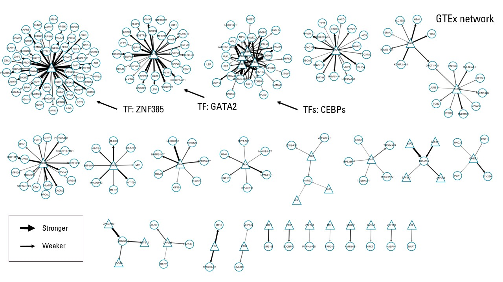
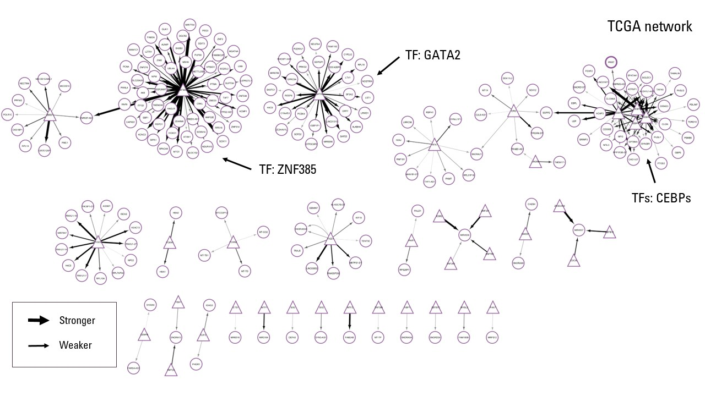
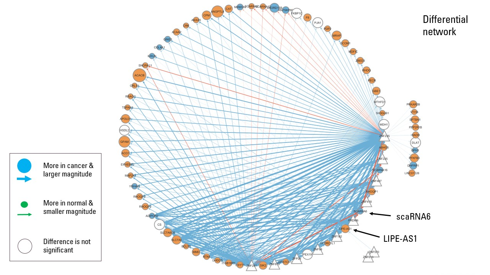
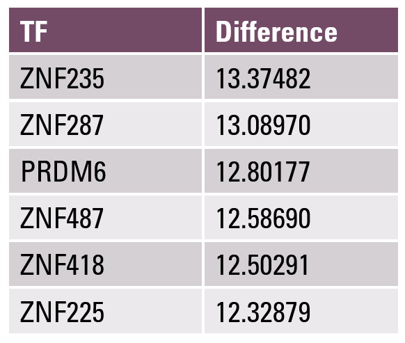
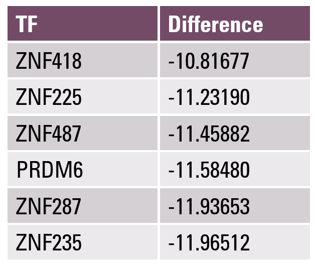

# Regulatory network inference using PANDA

We employ the PANDA algorithm to build gene regulatory networks for normal breast tissue and ER-negative breast cancer tissue using the GTEx and TCGA datasets respectively. We first export the gene expression data, which has previously been normalized, log-transformed, and filtered to remove lowly expressed genes. On the high performing computing environment, we use the provided protein-protein interaction and motif prior input files, and we use the command line interface to generate the networks.

```{r eval = F}
# Preparing files to be used for PANDA
rownames(gtex_filt) <- sub("\\..*", "", rownames(gtex_filt))
colnames(gtex_filt) <- sub("\\..*", "", colnames(gtex_filt))
rownames(tcga_filt) <- sub("\\..*", "", rownames(tcga_filt))
write.table(gtex_filt, file = "pre_panda_gtex.txt", sep = "\t", quote = F)
write.table(tcga_filt, file = "pre_panda_tcga.txt", sep = "\t", quote = F)

# PANDA commands
# netzoopy panda -e pre_panda_gtex.txt -m motif_997TFs_ensembl.txt -p 
# ppi_997TFs.txt --mode_process intersection --with_header -o ~/panda_gtex.txt
# netzoopy panda -e pre_panda_tcga.txt -m motif_997TFs_ensembl.txt -p 
# ppi_997TFs.txt --mode_process intersection --with_header -o ~/panda_tcga.txt
```

We next turn our attention to visualizing these networks using Cytoscape.

# Visualizations using Cytoscape

We construct three visualizations in total for our analysis: one visualization for each of the GTEx and TCGA networks, and one visualization for the differences in edge values and hence regulatory strengths between the two networks. We define the edge values in the differential network as the edge values of the TCGA network minus the edge values of the GTEx network. Hence, a positive difference indicates greater activity between a TF and a gene in ER-negative breast cancer tissue, while a negative difference indicates greater activity between a TF and a gene in normal breast tissue.

To start, we only use the 300 edges with the largest absolute values for each visualization. For clarity in our plots and analyses, we convert the Ensembl IDs to their corresponding gene names. We remove nodes and network edges involving pseudo-genes and novel transcripts since they lack gene names, which introduces the need for manual imputation, and their biological function is often less clear. Future directions and improvements to this project could involve elucidating their roles in the networks. For the differential network, we also included statisically significant differential expression data from the previous DEG section. After all data manipulation steps have been completed, we exported all necessary CSV files to Cytoscape to create the visualizations.

The GTEx, TCGA, and differential networks as visualized in Cytoscape are shown in Figures 1, 2, and 3 below.

```{r eval = F}
# Setup
library(biomaRt)
library(data.table)
ensembl_to_name <- function(vec) {
  mart <- useMart(biomart = "ensembl", dataset = "hsapiens_gene_ensembl",
                  host = "https://useast.ensembl.org")
  getBM(attributes = c("ensembl_gene_id", "external_gene_name"),
        filters = "ensembl_gene_id", values = unique(vec), mart = mart)
}
helper <- function(edges, s, r = F) {
  colnames(edges)[2] <- "ensembl_gene_id"
  ensembl_gene_tuple <- ensembl_to_name(edges[, 2])
  edges <- merge(edges, ensembl_gene_tuple, by = "ensembl_gene_id")
  edges <- edges[edges$external_gene_name != "",]
  write.table(edges, paste0("edges_", s, ".csv"), sep = ",",
              row.names = F, quote = F)
  # Separate categories for TFs and genes in Cytoscape
  write.table(rbind(data.frame(node = unique(edges$tf), type = 0),
                    data.frame(node = unique(edges$external_gene_name), type = 1)),
              paste0("edges_", s, "_map.csv"), sep = ",", row.names = F, quote = F)
  if (r) return(ensembl_gene_tuple)
}
panda_gtex <- fread("panda_gtex.txt")
panda_tcga <- fread("panda_tcga.txt")

# Preparing files to be used for visualizing GTEx and TCGA networks
n_edges <- 300
edges_gtex <- panda_gtex[panda_gtex$force > 10] # Next line runs faster
edges_gtex <- head(edges_gtex[order(-edges_gtex$force),], n_edges)
helper(edges_gtex, "gtex")
edges_tcga <- panda_tcga[panda_tcga$force > 10]
edges_tcga <- head(edges_tcga[order(-edges_tcga$force),], n_edges)
helper(edges_tcga, "tcga")

# Preparing files to be used for the differential network
edges_diff <- merge(panda_gtex[, -3], panda_tcga[, -3],
                    by = c("tf", "gene"), suffixes = c("_gtex", "_tcga"))
edges_diff$diff_value <- edges_diff$force_tcga - edges_diff$force_gtex
edges_diff <- edges_diff[abs(edges_diff$diff_value) > 10] # Next lines run faster
edges_diff$diff_sign <- sign(edges_diff$diff_value)
edges_diff$diff_value <- abs(edges_diff$diff_value)
edges_diff <- head(edges_diff[order(-edges_diff$diff_value),], n_edges)
edges_diff <- edges_diff[, c(1:2, 5:6)]
ensembl_gene_tuple <- helper(edges_diff, "diff", T)

# Preparing the differential expression file for the differential network
deg <- read.csv("DEG_results.csv")
deg <- deg[deg$pvalue < 1 / nrow(deg),]
colnames(deg)[1] <- "ensembl_gene_id"
deg$ensembl_gene_id <- sub("\\..*", "", deg$ensembl_gene_id)
deg <- merge(deg, ensembl_gene_tuple, by = "ensembl_gene_id")
deg <- deg[deg$external_gene_name != "",]
deg$log2foldchange_sign <- sign(deg$log2FoldChange)
deg$log2foldchange_value <- abs(deg$log2FoldChange)
deg <- deg[, c(2, 7:9)]
write.table(deg, "deg.csv", sep = ",", row.names = F, quote = F)

# Unused visualizations using R
# library(visNetwork)
# rvis <- function(edges) {
#   edges$arrows <- "to"
#   colnames(edges) <- c("from", "to", "motif", "force", "arrows")
#   nodes <- data.frame(id = unique(as.vector(as.matrix(edges[, c(1, 2)]))),
#                       label = unique(as.vector(as.matrix(edges[, c(1, 2)]))))
#   nodes$group <- ifelse(nodes$id %in% edges$from, "TF", "gene")
#   net <- visNetwork(nodes, edges, width = "100%")
#   net <- visGroups(net, groupname = "TF", shape = "square",
#                    color = list(background = "teal", border="black"))
#   net <- visGroups(net, groupname = "gene", shape = "dot",
#                    color = list(background = "gold", border="black"))
#   visLegend(net, main = "Legend", position = "right", ncol = 1)
# }
# rvis(edges_gtex)
```







The GTEx and TCGA networks appear somewhat similar, with the same three TFs (ZNF385, GATA2, the CEBP family) having the largest degrees in both networks, which underscores their importance in both normal and cancerous breast tissue. However, differences are also clearly visible: for instance, some TFs target the same genes as ZNF385 and the CEBP family in the TCGA network but not the GTEx network.

To further investigate the differences between the networks, we then proceed to look at the differential network, which is noticeably rather complex. TFs are depicted as triangles and genes are depicted as circles. For genes, blue = significantly more expression in the TCGA network, size = magnitude of expression, and white = no significant difference in expression between the networks.

As it turns out, there are only 12 TFs compared to 71 genes; this low TF-to-gene ratio supports the idea that a large proportion of the variance between the transcription profiles of normal and cancerous breast tissue can be explained by a small number of dimensions. All TFs are involved in the regulation of transcription by RNA polymerase II, while 11 TFs are zinc finger proteins. Two TFs have auxiliary functions: TPRDM6 is also involved in chromatin organization and remodeling by methylation and the neurogenesis pathway, while ZNF418 is also involved in the microautophagy and proteasomal ubiquitin-dependent protein catabolic process pathways.

We also noticed that the specific TFs and genes involved in the differential network are very different from the previous two networks. This is not surprising since the TF-to-gene relationships with the largest differences are not necessarily the same as the relationships with the largest network strengths in the GTEx and TCGA networks individually. One somewhat counterintuitive observation was that a lot of the connections that are stronger in the TCGA network involve genes which are less expressed in cancer cells. This could indicate that the TFs downregulate the activity of these genes; further research could be done to support this hypothesis.

The attentive reader may notice the labeled genes LIPE-AS1 and scaRNA6 in the differential network; they are the topic of our analysis below.

# Differential targeting TFs

We found the TFs with the largest differences of regulatory activity between the GTEx and TCGA networks by ranking the differential network edges with the largest magnitudes. This yielded 6 TFs for each direction of difference, shown below in Figures 4 and 5.

```{r eval = F}
library(dplyr)
# edges_diff <- read.csv("edges_diff.csv")
top_tf <- edges_diff |> group_by(tf, diff_sign) |>
  filter(diff_value == max(diff_value)) |> ungroup() |>
  mutate(diff = diff_sign * diff_value) |> arrange(-diff) |>
  select(tf, external_gene_name, diff)
colnames(top_tf) <- c("TF", "Gene", "Difference")
# top_tf[-(7:12),]
```

{width="30%"}

{width="30%"}

It turns out that all TFs with the largest positive differences (i.e., more regulatory activity in the TCGA network) target the LIPE-AS1 gene, while all TFs with the largest negative differences target the scaRNA6 gene. LIPE-AS1 is a non-coding RNA, with its biological function being unclear. However, it has previously been implicated in other cancers, such as lung, liver, and head and neck squamous carcinoma, suggesting a potential role in breast cancer as well (Lu et al. 2022, Thunen et al. 2021). On the other hand, scaRNA6 is a small nucleolar RNA that has been known to regulate the pseudouridylation of small nuclear RNA in the spliceosomal complex (Darzacq et al. 2002). The fact that scaRNA6 is less regulated in the TCGA network makes sense given the presumably high levels of splicing activity in breast cancer tissues. Potential future steps would involve diving deeper into the roles of LIPE-AS1 and scaRNA6 in biological pathways. Finally, we note that some TFs appear in both tables above, indicating that they can have dual functions in the networks.

# References

- Darzacq, X., Jády, B. E., Verheggen, C., Kiss, A. M., Bertrand, E., & Kiss, T. (2002). Cajal body-specific small nuclear RNAs: A novel class of 2'-O-methylation and pseudouridylation guide RNAs. The EMBO Journal, 21(11), 2746-2756. https://doi.org/10.1093/emboj/21.11.2746

- Lu, R., Li, Z., & Yin, S. (2022). Constructing a ferroptosis-related long non-coding RNA signature to predict the prognostic of head and neck squamous cell carcinoma patients by Bioinformatic analysis. Biochemical Genetics, 60(5), 1825-1844. https://doi.org/10.1007/s10528-021-10176-2

- Thunen, A., La Placa, D., Zhang, Z., & Shively, J. E. (2021). Role of lncRNA LIPE-AS1 in adipogenesis. Adipocyte, 11(1), 11-27. https://doi.org/10.1080/21623945.2021.2013415
